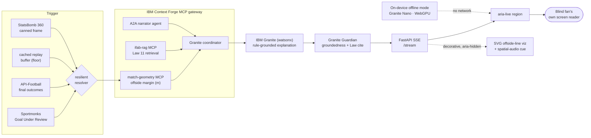

# VARSITY

**Verifiable, Accessible, Rule-grounded Soccer Transparency Interpreter for You.**

VARSITY is a real-time, screen-reader-native, IFAB-grounded AI explainer of VAR and offside decisions, built as a fan product. When a Video Assistant Referee review happens, VARSITY retrieves the governing Law of the Game, computes the offside geometry, generates a plain-language explanation of why the decision was made, and speaks it through the fan's own screen reader, in their language, before the broadcast picture catches up.

Built for the IBM SkillsBuild AI Builders Challenge (June 2026, Soccer / AI / World Cup).

## The problem

A blind football fan is often the last person in the room to understand a VAR call. The decision data exists (the applied Law, the offside geometry, the structured outcome) but it lives only in visual pipelines: stadium screens, broadcast overlays, and officials-only tools. No deployed product translates that into rule-grounded natural language delivered through a blind fan's accessibility channel in real time. VARSITY closes that last-mile gap.

## What makes it different

The first system that is **all four at once**: real-time, screen-reader-native, IFAB-Laws-grounded, and fan-facing, with offside coverage. Prior art (X-VARS, CVPR 2024; SoccerRef-Agents, 2026) is offline, referee-facing, and foul-only. VARSITY is what those would look like if they shipped to the fan who needs it.

## Capability honesty

Every capability is labeled by how it is wired, and each is verifiable in this repository. We do not claim a roadmap item as if it were built.

- **Wired-live**: runs in this repo and has been exercised end to end (tests and/or a live run this session).
- **Integration**: real, built, demo-scoped, but not on the hot path of the core demo.
- **Roadmap**: designed and specified, not yet built. Listed so the scope is honest.

| Capability | Tier | Where / how to verify |
|---|---|---|
| Offside-margin geometry from StatsBomb 360 freeze-frames | Wired-live | `services/app/geometry.py` + `services/tests/test_geometry.py` (real 2022 World Cup frame, 5.45 m) |
| IFAB-Laws retrieval (keyword + IBM Granite embeddings) | Wired-live | `services/app/rag/` over `laws.json` (exact Law 11 wording) |
| IBM Granite reasoning via watsonx (rule-grounded explanation citing the Law) | Wired-live | `services/app/llm/granite.py`; live run this session |
| Granite Guardian groundedness + Law-citation safety | Wired-live | `services/app/llm/guardian.py` + tests |
| SSE pipeline to a screen-reader `aria-live` region | Wired-live | `services/app/main.py`, `apps/web/src/App.tsx` |
| SVG offside-line visualization synced to the computed margin | Wired-live | `apps/web/src/OffsidePitch.tsx` (margin on screen equals the geometry value) |
| English / Spanish multilingual toggle | Wired-live | `apps/web/src/App.tsx`; the same call re-narrated in Spanish |
| Context Forge MCP + A2A federation | Wired-live | `services/app/mcp_servers/`, `app/a2a_agent/`, `app/federation.py`; tools routed through the gateway, `docs/federation.md` |
| Live-trigger resilience (Sportmonks to API-Football to cached replay buffer) | Wired-live | `services/app/triggers/`, `GET /stream/live` emits the transitional review event |
| Docling to FAISS IFAB-Laws ingestion | Integration | `services/app/rag/ingest.py` (build-time; the demo uses the curated `laws.json`) |
| 3D / GSAP cinematic hero | Wired-live | `apps/web/src/Hero3D.tsx` (React Three Fiber pitch, lazy-loaded, `aria-hidden`, motion-gated) + a GSAP intro |
| Spatial-audio HRTF sonification of the three key players | Wired-live | `apps/web/src/sonify.ts`; the attacker tone is panned right of the centred offside line by the margin |
| On-device offline mode (Transformers.js + WebGPU, Granite 4.0 Nano) | Wired-live | `apps/web/src/offline.ts`; generates a Law-grounded explanation fully in-browser, no backend (verified: 0 backend calls), with a deterministic floor when WebGPU is unavailable |
| Read-aloud for the sighted track (Web Speech floor + Kokoro-82M on-device) | Wired-live | `apps/web/src/tts.ts`; Web Speech API floor (verified) plus Kokoro-82M (`onnx-community/Kokoro-82M-v1.0-ONNX`) on WebGPU. The accessibility path stays the user's own screen reader |

## Architecture

One VAR offside event flows from a trigger, through the geometry and rule-grounding
backends coordinated by the IBM Context Forge MCP gateway, into a Granite explanation
that Granite Guardian gates, and out over SSE to the screen reader. See
[docs/federation.md](docs/federation.md) for the four-backend federation and the
VAR-event sequence diagram.



The canned StatsBomb path is the deterministic floor; the live trigger is a resilient flourish that falls back to a cached replay buffer. The screen-reader layer is always parallel to (and independent of) the decorative visual and audio layers.

## Tech

Only what is built and running is listed here. Roadmap technologies are in the table above.

- **Front end:** React 19, Vite 6, TypeScript, Tailwind CSS v4, a React Three Fiber + GSAP cinematic hero (lazy-loaded, motion-gated), an SVG offside-line visualization, a Web Audio HRTF spatial-audio cue, an on-device offline mode (Transformers.js + WebGPU, Granite 4.0 Nano, lazy-loaded), a sighted-track read-aloud (Web Speech API + Kokoro-82M on-device), ARIA live regions.
- **Backend:** FastAPI, IBM Context Forge (MCP gateway), IBM Granite + Granite Guardian via watsonx (raw ML REST), the official `mcp` and `a2a-sdk` SDKs (IFAB-RAG and geometry MCP servers, an A2A narrator agent), Sportmonks / API-Football triggers with a cached replay buffer, pure-Python offside geometry over StatsBomb 360 data.
- **Accessibility:** WCAG 2.2 AA, ARIA live regions (`assertive` for the verdict), screen-reader-native delivery, a `lang` attribute that switches the spoken voice, full keyboard support, decorative motion gated behind `prefers-reduced-motion`.

## Accessibility validation

Validation with blind and low-vision football fans and audio-description practitioners is in progress. Until a first-hand conversation is logged, the persona in the demo is presented as a researched hypothesis grounded in published vision-impairment and audio-description-access data, not as a quoted user. Outreach records are kept private and are not in this repository.

## Develop

```bash
# front end
cd apps/web && npm install && npm run dev
# backend
cd services && python -m venv .venv && source .venv/bin/activate && pip install -r requirements.txt && uvicorn main:app --reload
```

CI runs lint, typecheck, tests, and build on every push and pull request.

## License

Apache-2.0. See [LICENSE](LICENSE).
