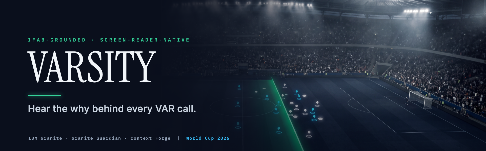

<p align="center">
  
</p>

# VARSITY

**Verifiable, Accessible, Rule-grounded Soccer Transparency Interpreter for You.**

VARSITY is a real-time, screen-reader-native, IFAB-grounded AI explainer of VAR and offside decisions, built as a fan product. When a Video Assistant Referee review happens, VARSITY retrieves the governing Law of the Game, computes the offside geometry, generates a plain-language explanation of why the decision was made, and speaks it through the fan's own screen reader, in their language, before the broadcast picture catches up.

Built for the IBM SkillsBuild AI Builders Challenge (June 2026, Soccer / AI / World Cup).

## The problem

A blind football fan is often the last person in the room to understand a VAR call. Audio description is improving and major tournaments increasingly offer it, but even great commentary rarely explains the rule-grounded reason behind a contested VAR or offside decision as it happens. The decision data exists (the applied Law, the offside geometry, the structured outcome) yet it lives only in visual pipelines: stadium screens, broadcast overlays, and officials-only tools. No deployed product turns that into rule-grounded natural language delivered through a blind fan's own accessibility channel in real time. VARSITY adds that layer. It complements audio description and commentary, it does not replace them.

## What makes it different

The first system that is **all four at once**: real-time, screen-reader-native, IFAB-Laws-grounded, and fan-facing, with offside coverage. Prior art (X-VARS, CVPR 2024; SoccerRef-Agents, 2026) is offline, referee-facing, and foul-only. VARSITY is what those would look like if they shipped to the fan who needs it.

## How VARSITY maps to the judging criteria

The challenge scores four criteria. Each maps to evidence you can run against the **live deployment** ([web-chi-wine-13.vercel.app](https://web-chi-wine-13.vercel.app)) from the in-page "prove it" panel, which calls the live backend ([varsity-api.onrender.com](https://varsity-api.onrender.com)) and shows the real result inline.

| Criterion | How VARSITY earns it (each runs live) |
|---|---|
| **1. Technical Execution** | A measured-not-asserted, defense-in-depth pipeline: a deterministic Law-11 proof tree (`law11.py`) feeds a multi-critic gate (deterministic-hard + advisory Granite Guardian, `verification.py`), calibrated uncertainty (`GET /calibration`, ECE 0.34% vs a 4.16% overconfident control), a SHA-256-signed RAG corpus that fails closed (`GET /corpus_integrity`), per-class + per-decision faithfulness with **zero structural leakage** (`GET /faithfulness`), ALCE citation precision/recall, and an oracle red-team regression at **13/13 caught, 0 leakage** (`GET /red_team`). IBM Granite + Granite Guardian + Granite embeddings + Docling + a Context Forge MCP federation, with an OpenTelemetry span tree you can run live in your own browser (`GET /trace`, the real geometry to law to granite to guardian spans with per-stage durations). RAG Hit@5 = 1.00, surfaced live (`GET /rag_eval`, the Granite-embeddings retrieval quality). |
| **2. Innovation** | The first system that is **all four at once** (real-time, screen-reader-native, IFAB-grounded, fan-facing) with offside coverage. Original AI-for-accessibility moves: **audible uncertainty** (the verdict earcon roughens as the call tightens, so a blind fan *hears* the confidence), the **honesty moat** (every claim is a live button), listener-centred HRTF spatial audio that animates the offside crossing, multi-source fusion confidence + speculative pre-warm + honest latency framing (`/fusion`, `/latency`), and a fully on-device, all-IBM, offline explanation. |
| **3. Challenge Fit** | The **2026 World Cup kicks off during this very challenge**, and VAR/offside is the single hardest moment to follow without sight: commentary announces "offside" but never the *why*, and audio description narrates the action, not the rule. VARSITY closes that exact gap. It runs on real **World Cup 2022** StatsBomb 360 freeze-frames, named (Canada v Morocco), with three real outcomes (offside 5.69 m / onside / too-close-to-call), grounded in the IFAB Laws of the Game. The real-world need was confirmed first-hand by a **blind supporter** on an audio-description community list; VARSITY complements (never replaces) audio description, in five languages. |
| **4. Implementation & Feasibility** | **Deployed and running** (Vercel + Render), CI-gated (lint + typecheck + tests + build + WCAG 2.2 axe-core a11y on every push). It **degrades, never crashes**: a watsonx outage (expired key, 429, timeout) falls through to the deterministic Law-citing floor instead of killing the stream, so a judge always gets an explanation. It runs fully on-device with no per-call cost, self-hosts its fonts (the deployed link never waits on a third party), targets a trigger-to-spoken budget under 10 s against the verified ~18-22 s OTA broadcast delay, and ships an external-service contract table plus an honest, partnership-first path to a real deployment (`docs/LEGAL.md`). |

## Capability honesty

Every capability is labeled by how it is wired, and each is verifiable in this repository. Every entry in the table below is wired-live: there are no roadmap-only, aspirational, or "coming soon" capabilities. We would rather under-claim than overstate.

- **Wired-live**: runs in this repo and has been exercised end to end (tests and/or a live run this session). Every capability listed below is at this tier.

| Capability | Tier | Where / how to verify |
|---|---|---|
| Offside-margin geometry from StatsBomb 360 freeze-frames | Wired-live | `services/app/geometry.py` (StatsBomb yards, `METERS_PER_UNIT = 0.9144`) over `services/tests/fixtures/wc2022_offside_frame.json` (a real 2022 World Cup frame); the live `GET /scenarios` reports **5.69 m offside / -3.14 m onside / 0.02 m too-close** |
| IFAB-Laws RAG: Docling to FAISS, IBM Granite embeddings online + BM25 offline | Wired-live | `services/app/rag/` over the real **IFAB Laws of the Game 2025/26** (18 Docling-ingested chunks incl. the VAR protocol); evaluated in `docs/benchmarks/rag-eval.md` |
| RAG retrieval evaluation (Hit-Rate@k + MRR over a golden IFAB set) | Wired-live | `services/evals/` + `docs/benchmarks/rag-eval.md`; CI-gated (Hit@5 = 1.00, every offside query routes to Law 11) |
| IBM Granite reasoning via watsonx (rule-grounded explanation citing the Law) | Wired-live | `services/app/llm/granite.py` (5 languages, prompt-leak guard); live run this session |
| Granite Guardian groundedness + Law-citation safety | Wired-live | `services/app/llm/guardian.py` + tests |
| OpenTelemetry per-request span tree (geometry to law to granite to guardian) | Wired-live | `services/app/observability.py`, `services/app/pipeline.py`; the real span tree is served live as `GET /trace` (per-stage durations) and runnable from the /judges panel |
| Context Forge MCP gateway + A2A narrator round-trip | Wired-live | `services/app/mcp_servers/`, `app/a2a_agent/` (real `message/send` round-trip in `client.py` + test), `app/federation.py`, `docs/federation.md` |
| Live-trigger resilience + "VAR is reviewing" announcement | Wired-live | `services/app/triggers/`, `GET /stream/live` emits the transitional review event; front-end Live / Replay toggle |
| SSE pipeline to a screen-reader `aria-live` region | Wired-live | `services/app/main.py`, `apps/web/src/Demo.tsx` (pre-registered region, verbosity-gated, re-announce-safe) |
| 5-language narration (EN / ES / FR / PT / DE) | Wired-live | `apps/web/src/Demo.tsx`; the same call re-narrated, the `lang` attribute flips the spoken voice |
| Spatial audio: listener-centred HRTF + animated offside crossing + semantic verdict earcon | Wired-live | `apps/web/src/sonify.ts`; the attacker tone moves past the centred offside line, then a major (onside) / minor+tritone (offside) earcon |
| SVG offside-line visualization synced to the computed margin | Wired-live | `apps/web/src/OffsidePitch.tsx` (margin on screen equals the geometry value) |
| Broadcast-delay ticker (Phenix-cited offset, live-measured delta) | Wired-live | `apps/web/src/BroadcastTicker.tsx`; lead = the OTA broadcast offset minus VARSITY's measured latency |
| Keyboard power-mode + stage scrubber + verbosity modes | Wired-live | `apps/web/src/Demo.tsx`, `StageScrubber.tsx`, `KeyboardHelp.tsx`; every action by one keypress, any step re-narrated |
| Shareable on-device audio clip | Wired-live | `apps/web/src/share.ts`, `tts.ts`; Kokoro WAV via the Web Share API with download / clipboard fallback |
| On-device offline mode: a 3-tier all-IBM ladder (deterministic floor / Granite 4.0 Nano 350M / opt-in Granite 4.0 1B) | Wired-live | `apps/web/src/offline.ts`; a Law-grounded explanation fully in-browser via Transformers.js + WebGPU, no backend (verified 0 backend calls), deterministic floor when WebGPU is absent; the 1B tier is a gated ~1.5 GB opt-in |
| Read-aloud for the sighted track (Web Speech floor + Kokoro-82M on-device) | Wired-live | `apps/web/src/tts.ts`; the accessibility path stays the user's own screen reader |
| 3D / GSAP cinematic hero | Wired-live | `apps/web/src/Hero3D.tsx` (React Three Fiber pitch, lazy-loaded, `aria-hidden`, motion-gated) + a GSAP intro |
| Multi-critic verification gate (deterministic-hard + advisory Guardian) over a neuro-symbolic Law-11 proof tree | Wired-live | `services/app/verification.py`, `law11.py`, `verbalizer.py`; the hard gate is dispositive, a Guardian false-positive is reported but never flips it |
| Calibrated uncertainty band ("VARSITY's Call") + ECE / Brier reliability receipt | Wired-live | `services/app/uncertainty.py`, `calibration.py`; `GET /calibration` (ECE 0.34% vs a 4.16% overconfident control, 40k seeded draws); too-close calls withhold the number and defer to the official |
| SHA-256-signed IFAB corpus, fail-closed verify-at-load (LLM08) | Wired-live | `services/app/rag/corpus_signature.py`; `GET /corpus_integrity` (verified, 18 chunks, root + 0 mismatches) |
| Oracle input hardening: HAP + prompt-injection screen + spotlighting (LLM01) | Wired-live | `services/app/safety/input_screen.py`; the free-text oracle fails closed; `GET /red_team` (13/13 attacks caught, 0 leakage, honest residual documented) |
| Faithfulness gold-eval (per injection class, per decision type) + ALCE citation precision/recall | Wired-live | `services/verify/faithfulness_eval.py`, `services/app/citation_metrics.py`; `GET /faithfulness` (zero structural leakage on offside / penalty / handball) |
| Multi-decision engine + "ask any rule" oracle (offside geometry; penalty / handball off the same RAG + Granite + Guardian path) | Wired-live | `services/app/decisions.py`, `pipeline.py`; `GET /decisions`, `GET /law_clause`, `GET /stream/ask` |
| Live-feed resilience: normalized `VARDecisionEvent` schema + multi-source fusion confidence + speculative pre-warm + honest latency | Wired-live | `services/app/triggers/` (schema/fusion/prewarm), `services/app/latency.py`; `GET /fusion`, `GET /latency` (Phenix-cited delays, < 10 s budget) |
| Measured-literature uncertainty: the broadcast-data sigma anchored to published, fetch-verified figures + a sensitivity envelope | Wired-live | `services/app/uncertainty.py`, `gum.py`, `docs/UNCERTAINTY_SOURCES.md`; `GET /uncertainty` (extended) returns the sigma sensitivity across the measured envelope; the clear demo call is robust at every sigma |
| Low-vision + keyboard a11y beyond the screen-reader core: forced-colors (Windows High Contrast Mode), global focus-visible, skip-link, WCAG 2.2 target-size, prefers-contrast | Wired-live | `apps/web/src/index.css`, `App.tsx`; the CI axe gate and the live /judges axe-core check both run the `wcag22aa` tag; `docs/ACCESSIBILITY.md` |

## Architecture

One VAR offside event flows from a trigger, through the geometry and rule-grounding
backends coordinated by the IBM Context Forge MCP gateway, into a Granite explanation
that Granite Guardian gates, and out over SSE to the screen reader. See
[docs/federation.md](docs/federation.md) for the four-backend federation and the
VAR-event sequence diagram.


The canned StatsBomb path is the deterministic floor; the live trigger is a resilient flourish that falls back to a cached replay buffer. The screen-reader layer is always parallel to (and independent of) the decorative visual and audio layers.

See [docs/IBM_STACK.md](docs/IBM_STACK.md) for every IBM component mapped to its file path and how to verify it is running, [docs/ACCESSIBILITY.md](docs/ACCESSIBILITY.md) for the WCAG conformance target, the `aria-live` design decision, and the screen-reader test matrix, and [docs/observability.md](docs/observability.md) for the OpenTelemetry trace of one VAR event with real measured stage timings (~2.8s end to end).

## Evaluation

The IFAB retrieval is measured, not asserted. A golden set of 20 VAR/offside questions mapped to the governing Law is run against the real retriever, scored directly (no inflated harness). Full report: [docs/benchmarks/rag-eval.md](docs/benchmarks/rag-eval.md).

| Path | Hit@1 | Hit@3 | Hit@5 | MRR |
|---|---|---|---|---|
| BM25 (offline / CI, deterministic) | 0.90 | 1.00 | 1.00 | 0.942 |
| Granite embeddings + FAISS (online) | 0.95 | 0.95 | 1.00 | 0.963 |

Every offside question routes to **Law 11 at rank 1**, and the two offline near-misses (goal-line to goal-kick, referee to VAR) recover by rank 2-3. CI fails if Hit@5 drops below 1.0. The deterministic **BM25 path is the committed, CI-gated artifact** (`services/evals/scores.json`); the online Granite-embeddings figures were measured separately against watsonx and are not persisted in CI (they need live credentials).

## Tech

Only what is built and running is listed here, and every capability in the table above is wired-live.

- **Front end:** React 19, Vite 6, TypeScript, Tailwind CSS v4, a multi-section cinematic site (React Three Fiber + GSAP hero, Lenis smooth scroll, scroll-reveals, liquid-glass), an SVG offside-line visualization, a listener-centred Web Audio HRTF spatial-audio engine with a semantic verdict earcon, a broadcast-delay ticker, keyboard power-mode + a stage scrubber + verbosity modes, a shareable on-device audio clip, an on-device offline mode (Transformers.js + WebGPU, Granite 4.0 Nano), a sighted-track read-aloud (Web Speech API + Kokoro-82M), 5-language narration (EN/ES/FR/PT/DE), ARIA live regions.
- **Backend:** FastAPI + SSE, IBM Context Forge (MCP gateway), IBM Granite + Granite Guardian via watsonx (raw ML REST), Docling to FAISS IFAB-Laws RAG, OpenTelemetry tracing, the official `mcp` and `a2a-sdk` SDKs (IFAB-RAG and geometry MCP servers, an A2A narrator agent with a real `message/send` round-trip), Sportmonks / API-Football triggers with a cached replay buffer, pure-Python offside geometry over StatsBomb 360 data.
- **Accessibility:** WCAG 2.2 AA, a pre-registered ARIA live region (`assertive` for the explicitly-requested verdict) with a re-announce-safe fix and verbosity control, screen-reader-native delivery, a `lang` attribute that switches the spoken voice, full keyboard support, decorative motion gated behind `prefers-reduced-motion`, axe-core + Playwright accessibility CI.

## Accessibility validation

We are validating VARSITY with blind and low-vision football fans and audio-description users. A first-hand reply from a blind supporter on an audio-description community list confirmed the core need: current match commentary often leaves them unsure what is happening on the pitch, and clear information on the rules during a contested moment would be genuinely helpful. That is exactly the gap VARSITY targets, alongside (not instead of) the audio description and commentary fans already rely on. Outreach records and any personal details are kept private and are not in this repository.

## Develop

```bash
# front end
cd apps/web && npm install && npm run dev
# backend
cd services && python -m venv .venv && source .venv/bin/activate && pip install -r requirements.txt && uvicorn main:app --reload
```

CI runs lint, typecheck, tests, and build on every push and pull request.

## Legal, IP & deployment

VARSITY is an independent project, not affiliated with FIFA, The IFAB, any league, club, or player. It **explains** decisions; it does not adjudicate them. Data is StatsBomb Open Data (non-commercial, attributed); the Laws are IFAB's, cited and paraphrased for an educational/accessibility purpose. The full treatment, including the honest path from this prototype to a partnership-first real deployment, is in [docs/LEGAL.md](docs/LEGAL.md).

## License

Apache-2.0. See [LICENSE](LICENSE), [NOTICE](NOTICE), and [THIRD_PARTY_LICENSES.md](THIRD_PARTY_LICENSES.md). Every shipped model is Apache-2.0; the runtime dependency tree carries no copyleft.
