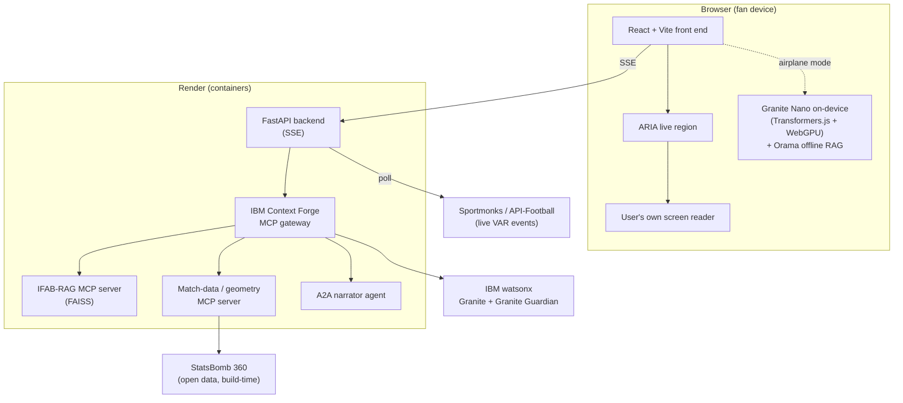
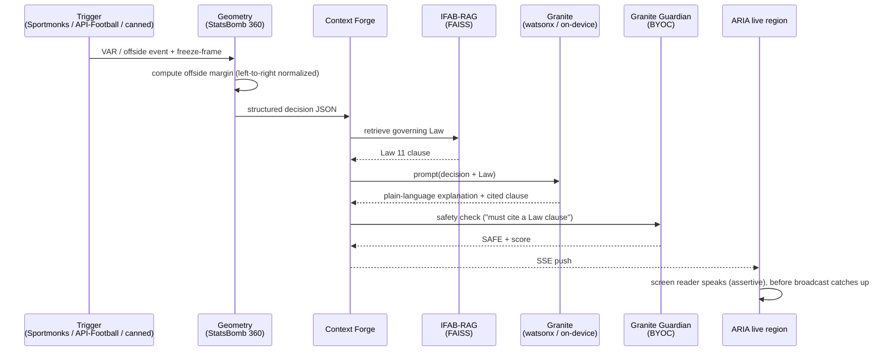

# VARSITY Architecture

## Container view

## VAR-event sequence

## Notes

- The federation registers exactly four services behind the gateway: IFAB-RAG MCP, match-data/geometry MCP, the A2A narrator agent, and the Granite coordinator. The `/admin` observability trace shows one VAR event fanning out across all four.
- The canned StatsBomb 360 path is the deterministic floor for the demo; the live trigger is the flourish. A cached replay buffer keeps the live path off the critical path.
- Offline mode runs the explanation entirely in the browser (Granite Nano + Orama), so it works with the network cut.
