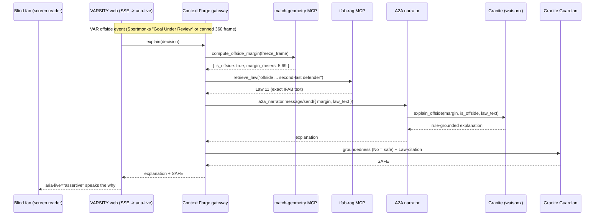

# VARSITY federation (Context Forge)

VARSITY's backend is a small federation behind the **IBM Context Forge** MCP
gateway. One VAR offside event fans out across four backends; the gateway's
`/admin` observability trace over that fan-out is the hero Technical-Execution
artifact.

## The four federated backends

| # | Backend | Kind | Tool / skill | Endpoint |
|---|---------|------|--------------|----------|
| 1 | `ifab-rag` | MCP server | `retrieve_law` (IFAB Law corpus) | SSE `:8001` |
| 2 | `match-geometry` | MCP server | `compute_offside_margin` (StatsBomb 360) | SSE `:8002` |
| 3 | `narrator` | A2A agent | `a2a_narrator` (`message/send`) | JSON-RPC `:9000` |
| 4 | Granite coordinator | watsonx | `explain_offside` reasoning | watsonx ML REST |

Granite Guardian (`groundedness` + Law-citation) gates the output before it
reaches the fan's screen reader.

## Sequence: one offside decision, fanned out



## Bringing it up

```bash
# 1. gateway (Docker)
cd infra && docker compose up -d            # Context Forge on :4444

# 2. the three host backends
services/scripts/run_federation.sh          # ifab-rag :8001, match-geometry :8002, narrator :9000

# 3. register them (gateway URL/token + the host the gateway reaches them on)
cd services && PYTHONPATH=. \
  CONTEXT_FORGE_URL=http://localhost:4444 \
  CONTEXT_FORGE_BACKEND_HOST=localhost \
  CONTEXT_FORGE_TOKEN="$TOKEN" \
  python -m scripts.register_federation
#   dry run (no gateway needed):  python -m scripts.register_federation --dry-run

# 4. open http://localhost:4444/admin -> Gateways / Tools / Observability
```

## Run the gateway (the working path)

The Docker GA `latest` arm64 image hangs at startup (see `infra/README.md` "KNOWN
ISSUE"). The working path is the **PyPI gateway on the host, single uvicorn worker,
with SSRF allowed for local backends**:

```bash
python3.12 -m venv /tmp/cfgw && /tmp/cfgw/bin/pip install mcp-contextforge-gateway==1.0.2
export JWT_SECRET_KEY="<32+ char secret>" AUTH_ENCRYPTION_SECRET="<32+ char secret>"
export SSRF_ALLOW_LOCALHOST=true SSRF_ALLOW_PRIVATE_NETWORKS=true
export MCPGATEWAY_UI_ENABLED=true MCPGATEWAY_ADMIN_API_ENABLED=true AUTH_REQUIRED=true
/tmp/cfgw/bin/mcpgateway mcpgateway.main:app --host 0.0.0.0 --port 4444 --workers 1
# token:
TOKEN=$(/tmp/cfgw/bin/python -m mcpgateway.utils.create_jwt_token \
  --username admin@example.com --exp 10080 --secret "$JWT_SECRET_KEY")
```

Registration schemas (confirmed vs the live gateway): MCP servers ->
`POST /gateways {name, url, transport:"SSE"}`; A2A agents -> `POST /a2a` nested as
`{"agent": {name, endpoint_url}}`. SSRF blocks localhost/private hosts unless the
two `SSRF_ALLOW_*` flags are set.

## Verified live (2026-06-02)

Against PyPI gateway 1.0.2: all 4 backends registered and **reachable** (ifab-rag +
match-geometry over SSE, narrator A2A); the 3 tools were discovered
(`ifab-rag-retrieve-law`, `match-geometry-compute-offside-margin`, `a2a-narrator`)
and **invoked through the gateway** (`POST /rpc`) with correct results:
`retrieve_law` -> Law 11, `compute_offside_margin` -> margin 1.75 m. Gateway
observability recorded **10 tool executions, 100% success, ~27 ms average** (the
data the `/admin/observability` view visualizes).

**Rollback for the artifact:** the metrics API (`/metrics`,
`/admin/observability/*`) carries the same fan-out data if the UI does not render;
or fall back to OpenTelemetry -> Jaeger / Grafana Tempo. The gateway stays in the
architecture either way.

## Gateway-mediated A2A round-trip

`narrate_via_a2a` (in `a2a_agent/client.py`) reaches the narrator on its own port. To drive the same
agent THROUGH the gateway, `a2a_agent/gateway.py` builds the A2A `message/send` JSON-RPC envelope
(the protobuf-mapped JSON: a typed `{"kind": "text", "text": ...}` part plus a `messageId`, which a
flat body does not satisfy) and POSTs it to the gateway's federated-agent RPC path. The envelope
builder and the narration extractor are pure and unit-tested (`tests/test_a2a_gateway.py`); the POST
is verify-first, confirm the RPC path against the running gateway version before relying on it.
