# Observability: one VAR event, fanned out

VARSITY instruments the pipeline with **OpenTelemetry**. Every request to `/stream`
opens a span, and each stage runs in a child span (`geometry`, `law`, `granite`,
`guardian`) carrying attributes (`varsity.is_offside`, `varsity.margin_meters`,
`varsity.law`, `varsity.model`, `varsity.safe`, `varsity.grounded`,
`varsity.screen_reader_ok`). A running server prints the whole span tree to stdout via
a `ConsoleSpanExporter` - no collector required (`services/app/observability.py`,
`services/app/pipeline.py`).

## A real trace

These are **actual measured durations** from one canned 2022 World Cup offside event
through the full pipeline against live watsonx (captured with an in-memory span
exporter):

```mermaid
gantt
    title One VAR event fanned out - real OpenTelemetry trace (~2.8s, well inside the ~20s broadcast delay)
    dateFormat x
    axisFormat %Lms
    section Pipeline
    geometry - pure-Python offside margin            :geo, 0, 4ms
    law - IFAB retrieval (Granite embed + FAISS)     :law, after geo, 1116ms
    granite - explanation (watsonx Granite)          :crit, gen, after law, 1239ms
    guardian - Granite Guardian safety               :grd, after gen, 468ms
```



| Stage | Duration | What it is |
|---|---|---|
| `geometry` | ~0 ms | Pure-Python offside-margin computation over the StatsBomb 360 frame |
| `law` | ~1116 ms | IFAB Law retrieval (Granite embedding of the query + FAISS search) |
| `granite` | ~1239 ms | The rule-grounded explanation from IBM Granite via watsonx |
| `guardian` | ~468 ms | Granite Guardian groundedness + screen-reader-prose safety (two criteria, run concurrently) |

Total end-to-end is roughly **2.8 seconds**, comfortably inside the ~16-22 second
over-the-air broadcast delay (Phenix real-time latency study) the front-end ticker
cites: VARSITY reaches the blind fan well before the picture catches up.

## See it yourself

```bash
cd services && source .venv/bin/activate
python -m uvicorn app.main:app --port 8000 &
curl -N "http://localhost:8000/stream/canned?language=English"   # triggers a trace
# the server stdout prints the geometry/law/granite/guardian spans under the request span
```
